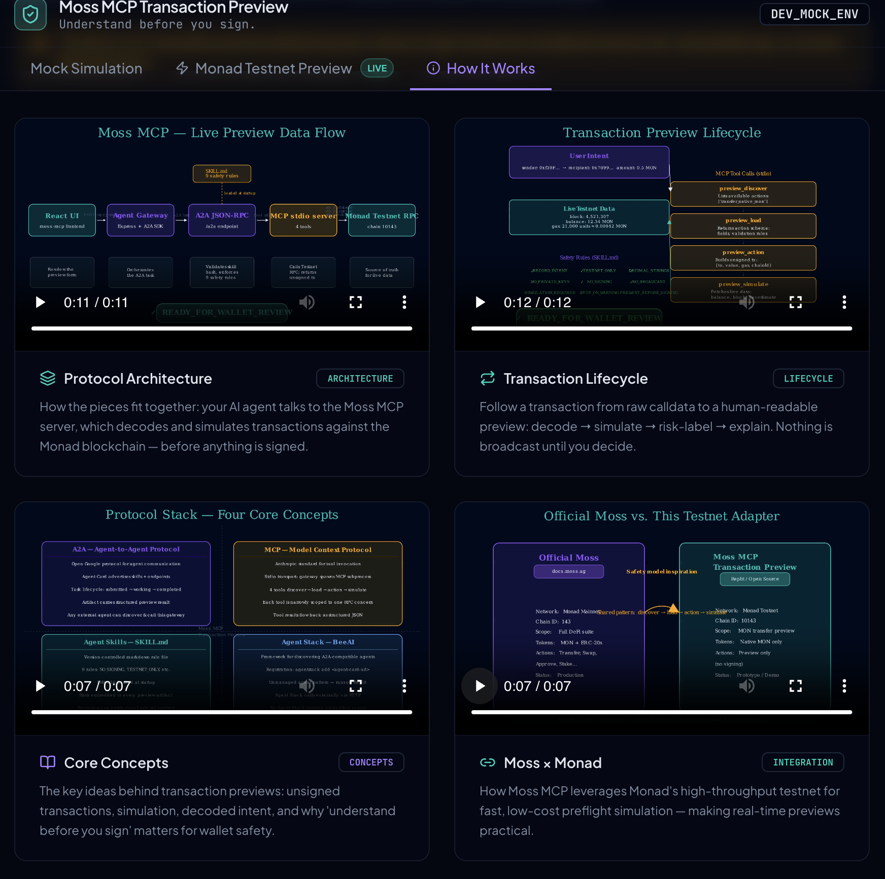

# Moss MCP Transaction Preflight | Moss MCP 交易安全预检

**Agentic Pre-Sign Protection on Monad | Monad 上的智能体签名前安全层**

**Preview. Verify. Sign with confidence. | 先预览，再验证，安心签名。**

  
  
  
  

---

## English

### Table of Contents

| EN | 中文 |
|---|---|
| [Basic fields](#en-basic-fields) | [基本信息](#zh-basic-fields) |
| [Short description](#en-short-description) | [项目简介](#zh-short-description) |
| [1. Problem](#en-1-problem) | [1. 用户痛点](#zh-1-problem) |
| [2. Solution](#en-2-solution) | [2. 解决方案](#zh-2-solution) |
| [3. How it works](#en-3-how-it-works) | [3. 工作流程](#zh-3-how-it-works) |
| [4. Why this is different](#en-4-why-different) | [4. 项目创新](#zh-4-why-different) |
| [5. Moss x Monad relationship](#en-5-moss-monad) | [5. Moss x Monad 的关系](#zh-5-moss-monad) |
| [6. Real implementation and evidence](#en-6-evidence) | [6. 真实实现与证据](#zh-6-evidence) |
| [7. Safety boundary](#en-7-safety-boundary) | [7. 安全边界](#zh-7-safety-boundary) |
| [8. Target users](#en-8-target-users) | [8. 目标用户](#zh-8-target-users) |
| [9. Roadmap](#en-9-roadmap) | [9. 后续计划](#zh-9-roadmap) |
| [10. Links](#en-10-links) | [10. 链接](#zh-10-links) |

### Basic fields

| Field | Value |
|---|---|
| Project title | Moss MCP Transaction Preflight |
| Project subtitle | Agentic Pre-Sign Protection on Monad |
| Tagline | Preview. Verify. Sign with confidence. |
| Front-end demo | https://moss-mcp-transaction.replit.app/ |
| GitHub repository | https://github.com/sunshineluyao/Moss-Mcp-Transaction |
| Associated event | Monad Playground Hackathon |

### Short description

Moss MCP Transaction Preview is an agentic preflight safety layer for native MON transfers on Monad Testnet. It records the user's intent, applies nine fail-closed Agent Skill rules, orchestrates the request through A2A, calls four MCP tools against live chain state, and returns an explainable `READY_FOR_WALLET_REVIEW` or `BLOCKED` artifact before wallet confirmation.

### 1. Problem

Web3 users are often asked to sign opaque transaction prompts without clearly understanding the network, recipient, amount, gas, or likely failure conditions. AI agents can make this worse if they move too quickly from intent to execution. New users need an explainable checkpoint that preserves human control.

### 2. Solution

Moss MCP Transaction Preview converts a native MON transfer request into a structured preflight artifact before wallet confirmation. The agent records the sender, recipient, and decimal-string amount; applies nine safety rules; checks Monad Testnet state through a custom MCP adapter; and returns one of two explicit decisions:

- `READY_FOR_WALLET_REVIEW`: all preflight checks passed; the unsigned transaction may be shown to the user's wallet for review.
- `BLOCKED`: at least one check failed; the flow stops and explains why.

### 3. How it works

<table>
  <tr>
    <td align="center">
      
       
      <strong>How It Works UI</strong> - Visual overview of the preflight screen, pipeline, and evidence cards.
    </td>
  </tr>
</table>

1. **User intent** - Enter or connect a sender address, then provide the recipient and MON amount. No private key is requested.
2. **Agent Skill** - A version-controlled `SKILL.md` enforces nine rules: `RECORD_INTENT`, `TESTNET_ONLY`, `DECIMAL_STRINGS`, `NO_PRIVATE_KEYS`, `NO_SIGNING`, `NO_BROADCAST`, `SIMULATION_REQUIRED`, `STOP_ON_WARNING`, and `PRESENT_BEFORE_SIGNING`. Its SHA-256 hash is embedded in every artifact.
3. **A2A** - The Agent Gateway packages the request as an A2A task and returns traceable task, context, and artifact identifiers.
4. **MCP** - A custom stdio MCP server runs `preview_discover -> preview_load -> preview_action -> preview_simulate`.
5. **Monad Testnet** - The server checks chain ID 10143, address validity, balance, gas estimation, gas price, latest block, and contract-recipient status when available.
6. **Explainable decision** - The UI presents the unsigned transaction, evidence, warnings, safety flags, and final `READY_FOR_WALLET_REVIEW` or `BLOCKED` decision before any wallet action.

### 4. Why this is different

- **Fail-closed, not "AI decides."** Any warning blocks the flow; the agent cannot silently continue.
- **Rules are verifiable.** The exact Agent Skill is version-controlled and content-hashed into each result.
- **Interoperable by design.** A2A handles agent communication, while MCP isolates blockchain tools from agent logic.
- **Human control is preserved.** The preview pipeline never handles private keys. In the latest source, an optional MetaMask continuation is available only after a `READY` result and explicit confirmation inside the wallet.

### 5. Moss x Monad relationship

Official Moss is a Monad DeFi safety layer whose MCP server targets Monad mainnet. This project does **not** claim to run the official Moss execution engine. It is a custom Monad Testnet adapter inspired by Moss's `discover -> load -> action -> simulate` pattern, risk labels, and unsigned-transaction-first safety model.

### 6. Real implementation and evidence

- React interface with separate mock-learning and live Monad Testnet modes.
- Express Agent Gateway using A2A v1 task/artifact structures.
- Custom MCP stdio server with four narrowly scoped tools.
- Live Monad Testnet RPC adapter using chain ID 10143.
- Version-controlled Agent Skill with nine enforced rules and SHA-256 provenance.
- Captured live run in `evidence/demo-run.json`: all four MCP tools executed and the request was safely `BLOCKED` when gas estimation reported insufficient balance; no transaction was submitted.
- Reproducible Manim animations and source files for architecture, transaction lifecycle, protocol concepts, and the Moss-Monad relationship.
- A clean local checkout at commit `4bc1707` passed **91 automated tests** (80 gateway/MCP/A2A/RPC/policy tests + 11 wallet-handoff tests), both TypeScript type checks, the gateway build, and the production front-end build on 2026-08-08.

### 7. Safety boundary

- The preview agent never requests or stores private keys or seed phrases.
- The preview agent itself does not sign or broadcast.
- Any missing simulation evidence or warning produces `BLOCKED`.
- RPC preflight is a snapshot, not a guarantee of future execution success.
- Educational/testnet use only; no financial advice.

### 8. Target users

Web3 newcomers who need plain-language transaction explanations; Monad dApp developers who need a reusable preflight layer; and agent/security builders evaluating safe human-in-the-loop execution.

### 9. Roadmap

Next steps include reliable production routing for the public Agent Gateway, externally verified Agent Stack registration, ERC-20 transfer previews, shareable preview reports, and a fully consistent wallet handoff that preserves the preview policy boundary.

### 10. Links

- Demo: https://moss-mcp-transaction.replit.app/
- GitHub: https://github.com/sunshineluyao/Moss-Mcp-Transaction
- Reproducibility DOI: https://doi.org/10.5281/zenodo.21539761
- Moss reference: https://docs.moss.ag

---

## 中文

### 目录

| EN | 中文 |
|---|---|
| [Basic fields](#en-basic-fields) | [基本信息](#zh-basic-fields) |
| [Short description](#en-short-description) | [项目简介](#zh-short-description) |
| [1. Problem](#en-1-problem) | [1. 用户痛点](#zh-1-problem) |
| [2. Solution](#en-2-solution) | [2. 解决方案](#zh-2-solution) |
| [3. How it works](#en-3-how-it-works) | [3. 工作流程](#zh-3-how-it-works) |
| [4. Why this is different](#en-4-why-different) | [4. 项目创新](#zh-4-why-different) |
| [5. Moss x Monad relationship](#en-5-moss-monad) | [5. Moss x Monad 的关系](#zh-5-moss-monad) |
| [6. Real implementation and evidence](#en-6-evidence) | [6. 真实实现与证据](#zh-6-evidence) |
| [7. Safety boundary](#en-7-safety-boundary) | [7. 安全边界](#zh-7-safety-boundary) |
| [8. Target users](#en-8-target-users) | [8. 目标用户](#zh-8-target-users) |
| [9. Roadmap](#en-9-roadmap) | [9. 后续计划](#zh-9-roadmap) |
| [10. Links](#en-10-links) | [10. 链接](#zh-10-links) |

### 基本信息

| 字段 | 内容 |
|---|---|
| 项目标题 | Moss MCP 交易安全预检 |
| 项目副标题 | Monad 上的智能体签名前安全层 |
| 一句话口号 | 先预览，再验证，安心签名。 |
| 前端演示地址 | https://moss-mcp-transaction.replit.app/ |
| GitHub 仓库 | https://github.com/sunshineluyao/Moss-Mcp-Transaction |
| 关联活动 | Monad Playground 黑客松 |

### 项目简介

Moss MCP Transaction Preview 是面向 Monad 测试网原生 MON 转账的 Agent 交易安全预检层。它记录用户意图，执行 9 条 fail-closed Agent Skill 规则，通过 A2A 编排任务，并由 4 个 MCP 工具读取链上状态，在钱包确认前返回可解释的 `READY_FOR_WALLET_REVIEW` 或 `BLOCKED` 结果。

### 1. 用户痛点

Web3 用户经常在没有看清网络、收款地址、金额、Gas 与潜在失败原因时就被要求签名。如果 AI Agent 从意图直接跳到执行，风险会进一步放大。新用户需要一个可解释、可核查、保留人工控制权的签名前检查点。

### 2. 解决方案

Moss MCP Transaction Preview 会在钱包确认前，把原生 MON 转账请求转化为结构化预检报告。Agent 记录发送方、接收方与十进制字符串金额，执行 9 条安全规则，通过自定义 MCP 适配器检查 Monad 测试网状态，并返回两种明确结论：

- `READY_FOR_WALLET_REVIEW`：全部预检通过，可将未签名交易交给用户钱包继续审核。
- `BLOCKED`：任一检查失败，流程立即停止并解释原因。

### 3. 工作流程

<table>
  <tr>
    <td align="center">
      
       
      <strong>How It Works 页面</strong> - 展示预检流程、证据卡片与最终结论区域。
    </td>
  </tr>
</table>

1. **用户意图** - 输入或连接发送地址，填写接收地址和 MON 金额，不请求私钥。
2. **规则层** - 版本化 `SKILL.md` 执行 9 条规则：`RECORD_INTENT`、`TESTNET_ONLY`、`DECIMAL_STRINGS`、`NO_PRIVATE_KEYS`、`NO_SIGNING`、`NO_BROADCAST`、`SIMULATION_REQUIRED`、`STOP_ON_WARNING`、`PRESENT_BEFORE_SIGNING`。每份产物都会附带其 SHA-256 哈希。
3. **A2A 编排** - Agent Gateway 将请求封装为 A2A 任务，并返回可追踪的 task/context/artifact 标识。
4. **MCP 工具调用** - 自定义 stdio MCP 服务按顺序执行 `preview_discover -> preview_load -> preview_action -> preview_simulate`。
5. **Monad 测试网检查** - 检查 chain ID 10143、地址有效性、余额、Gas 估算、Gas Price、最新区块，以及可用情况下的合约接收方状态。
6. **可解释结论** - 在任何钱包动作前，UI 展示未签名交易、证据、告警、安全标志和最终 `READY_FOR_WALLET_REVIEW` 或 `BLOCKED` 结论。

### 4. 项目创新

- **不是“AI 替你决定”，而是 fail-closed。** 任一警告都会阻断流程，Agent 不得静默继续。
- **规则可验证。** 每个结果都包含所应用 Skill 的内容哈希，可追溯具体规则版本。
- **原生互操作。** A2A 负责 Agent 通信，MCP 将区块链工具与 Agent 逻辑解耦。
- **保留人工控制。** 预检链路不接触私钥；最新源码中的可选 MetaMask 后续步骤，仅会在 `READY` 后由用户在钱包内明确确认。

### 5. Moss x Monad 的关系

官方 Moss 是面向 Monad 主网的 DeFi 安全层。本项目**不声称使用官方 Moss 执行引擎**；它是一个自定义 Monad 测试网适配器，借鉴了 Moss 的 `discover -> load -> action -> simulate` 生命周期、风险标签与“未签名交易优先”的安全设计。

### 6. 真实实现与证据

- React 界面同时提供 mock 学习模式与 Monad 测试网实时模式。
- Express Agent Gateway 使用 A2A v1 的任务/产物结构。
- 自定义 MCP stdio 服务，包含四个职责单一的工具。
- 通过 chain ID 10143 连接 Monad Testnet RPC。
- 版本化 Agent Skill，9 条规则强制执行，并附带 SHA-256 溯源。
- `evidence/demo-run.json` 记录了一次真实运行：四个 MCP 工具全部执行，当 Gas 估算显示余额不足时，系统安全返回 `BLOCKED`，且未提交任何交易。
- 提供可复现的 Manim 动画及源文件：架构、交易生命周期、协议概念、Moss-Monad 关系。
- 在 2026-08-08，基于提交 `4bc1707` 的干净本地代码通过 **91 项自动化测试**（80 项 gateway/MCP/A2A/RPC/policy + 11 项 wallet-handoff），并通过 TypeScript 双重类型检查、gateway 构建与前端生产构建。

### 7. 安全边界

- 预检 Agent 不请求或保存私钥、助记词。
- 预检 Agent 本身不签名、不广播。
- 缺少模拟证据或出现任一警告时，必须返回 `BLOCKED`。
- RPC 预检只是当前状态快照，不保证未来执行结果。
- 仅用于教育与测试网演示，不构成金融建议。

### 8. 目标用户

需要通俗交易解释的 Web3 新用户、希望复用预检层的 Monad dApp 开发者，以及研究安全人机协作执行的 Agent 与安全开发者。

### 9. 后续计划

下一步包括稳定的公共 Agent Gateway 路由、经外部验证的 Agent Stack 注册、ERC-20 转账预检、可分享预检报告，以及与预检规则边界完全一致的钱包交接流程。

### 10. 链接

- Demo: https://moss-mcp-transaction.replit.app/
- GitHub: https://github.com/sunshineluyao/Moss-Mcp-Transaction
- 可复现 DOI: https://doi.org/10.5281/zenodo.21539761
- Moss 参考文档: https://docs.moss.ag

---

## Visual Evidence | 可视化证据

<table>
  <tr>
    <td align="center" width="50%">
      
       
      <strong>Success Path</strong> | 成功路径
    </td>
    <td align="center" width="50%">
      
       
      <strong>Rejected / Reverted</strong> | 拒绝与回滚
    </td>
  </tr>
  <tr>
    <td colspan="2" align="center">
      
       
      <strong>Full Walkthrough</strong> | 完整流程演示
    </td>
  </tr>
</table>

<table>
  <tr>
    <td align="center" width="50%">
      
       
      <strong>Architecture Flow</strong> | 架构流程
    </td>
    <td align="center" width="50%">
      
       
      <strong>Transaction Lifecycle</strong> | 交易生命周期
    </td>
  </tr>
  <tr>
    <td align="center" width="50%">
      
       
      <strong>Concepts Overview</strong> | 核心概念
    </td>
    <td align="center" width="50%">
      
       
      <strong>Moss x Monad</strong> | 关系示意
    </td>
  </tr>
</table>

## License | 许可证

MIT License.
