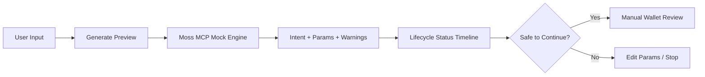
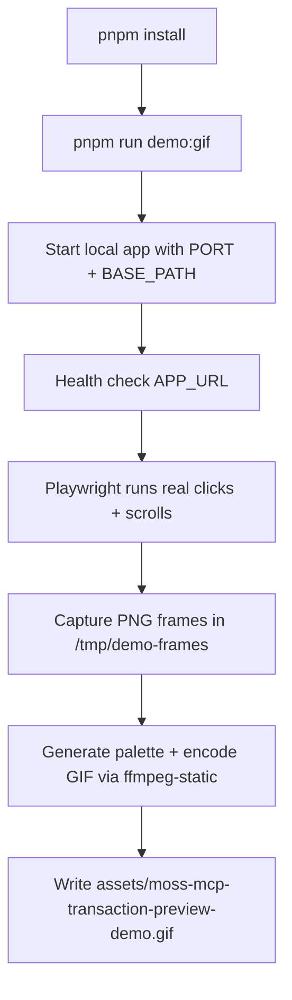
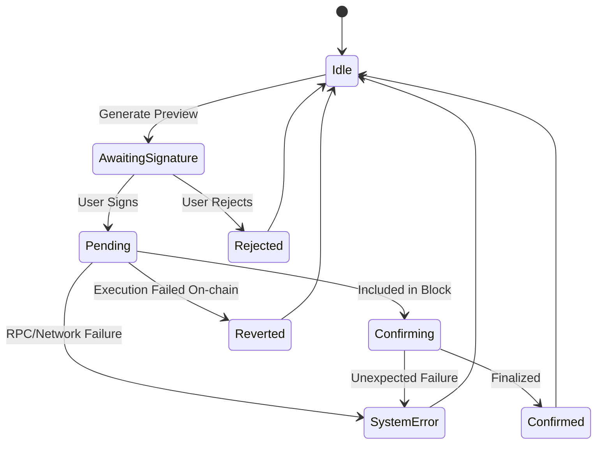
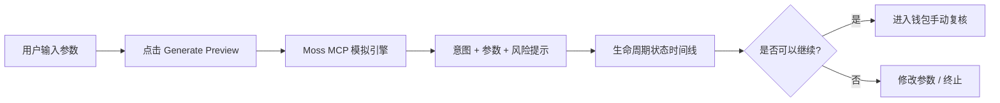
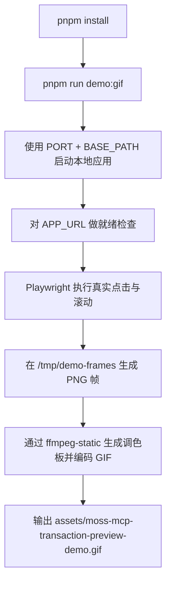
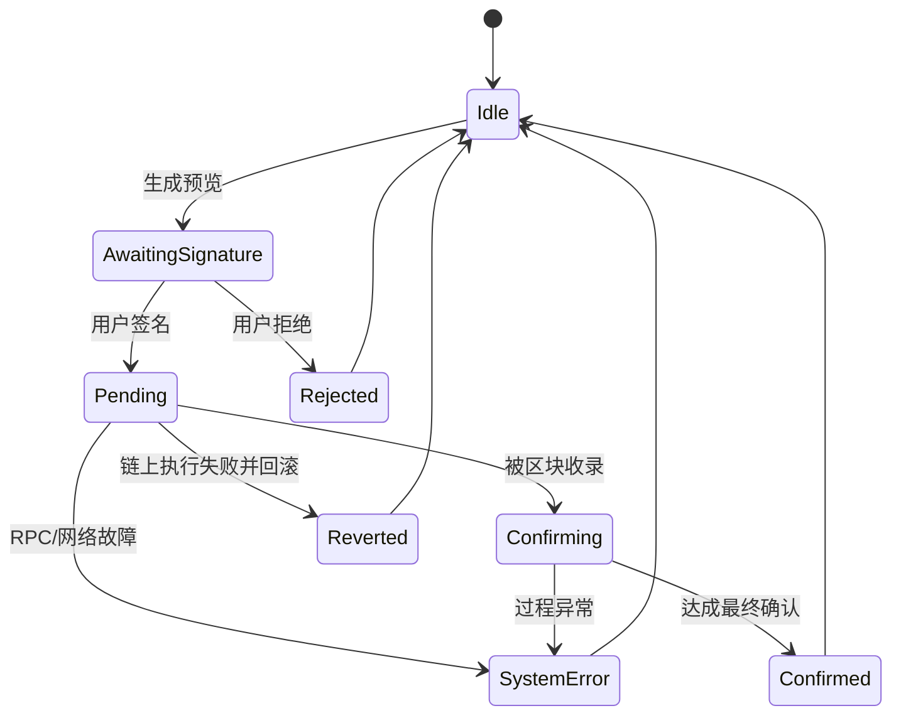

# Moss MCP Transaction Preview

<p align="center">
  <strong>🌿 Safer Web3 Preview Experience · 更安全的 Web3 预览体验</strong>
</p>

<p align="center">
  <a href="#english-version"><strong>English</strong></a> ·
  <a href="#中文版本"><strong>中文</strong></a>
</p>

<p align="center">
  
  
  
  
  
  
</p>

<p align="center">
  
  
  
  
  
</p>

<p align="center">
  
</p>

<p align="center">
  <strong>🧩 Preview First · Explain Risks · Keep Users In Control</strong><br/>
  <strong>先预览，再解释风险，始终由用户掌控</strong>
</p>

---

## English Version

### ✨ Quick Navigation

- [🚀 Live Demo](#live-demo)
- [🎯 Demo Goal](#demo-goal)
- [🧭 User Experience Walkthrough](#user-experience-walkthrough)
- [🗺️ Visual Flow Diagram](#visual-flow-diagram)
- [🎬 Demo GIF Generation Pipeline](#demo-gif-generation-pipeline)
- [⚙️ Core Features](#core-features)
- [📊 Status Lifecycle](#status-lifecycle)
- [🛣️ Roadmap](#roadmap)

### 🧠 What This Demo Is

Moss MCP Transaction Preview is a beginner-friendly Web3 demo that helps users understand a blockchain operation before signing. It uses a Moss MCP-style preview and simulation flow to explain operation intent, parameters, status, warnings, and safety boundaries. The demo is designed for learning and product testing. It is not an auto-trading agent and does not sign or broadcast transactions.

### 🚀 Live Demo

🔗 **Live Demo:** https://moss-mcp-transaction.replit.app/

### 🌟 Snapshot

| Focus | What You Get |
|------|---------------|
| 🛡️ Safety | Clear warning language before any signing step |
| 🧠 Clarity | Human-readable intent + parameter breakdown |
| 🧪 Learning | Mock-first flow for safe experimentation |
| 🔄 State Tracking | Full lifecycle from Idle to Confirmed/Reverted |

### 🎯 Demo Goal

- Help beginners understand a blockchain operation before signing.
- Show the full transaction lifecycle and its possible states.
- Explain the difference between Rejected, Reverted, and System Error.
- Make Moss MCP easier to understand for newcomers and developers.

### 🧭 User Experience Walkthrough

1. Read the top introduction to understand what the app does.
2. Learn what Moss MCP means in this demo context.
3. Choose a mock operation type (Transfer, Approve, or Swap).
4. Enter test-only parameters — no real addresses or funds required.
5. Click **Generate Preview**.
6. Read the preview card: protocol, method, intent, and parameters.
7. Check the status badge and follow the status timeline.
8. Review any warnings and the safety checklist before proceeding.

### 🗺️ Visual Flow Diagram



### 🎬 Demo GIF Generation Pipeline

This repository includes a reproducible script pipeline to generate `assets/moss-mcp-transaction-preview-demo.gif` from real UI interaction.



**Commands**

```bash
pnpm install
pnpm run demo:gif
```

**What the capture includes (post-click coverage):**

- Expand "What is Moss MCP?"
- Configure operation/scenario/amount
- Click **Generate Preview**
- Wait for preview result card to appear
- Scroll and capture risk/warnings/status lifecycle sections

### 🔍 What Is Moss MCP?

- **MCP** stands for Model Context Protocol.
- **Moss MCP** is a structured interface between AI agents and Moss/Web3 operations.
- In this demo, it is used conceptually for the `discover → load → action → simulate` lifecycle.
- It is used for preview and simulation **before** signing — not for automatic execution.

### ⚙️ Core Features

- Beginner-friendly transaction preview
- Mock operation scenarios (Transfer, Approve, Swap)
- Status badge timeline with 8 lifecycle states
- Preview result explanation ("How to read this preview" guide)
- Safety checklist before proceeding to wallet
- Clear distinction between Rejected / Reverted / System Error
- Mock-first design — safe to test with no real funds
- Future Moss RPC / Monad test chain integration plan

### 📊 Status Lifecycle

| Status | Meaning |
|--------|---------|
| **Idle** | No simulation has been run yet. |
| **Awaiting Signature** | The transaction is built and waiting for the user to sign. |
| **Pending** | The signed transaction has been submitted and is waiting to be picked up by the network. |
| **Confirming** | The transaction has been included in a block and is accumulating confirmations. |
| **Confirmed** | The transaction is finalized — the on-chain state has changed. |
| **Rejected** | The user declined to sign. Nothing was broadcast; the chain is unchanged. |
| **Reverted** | The transaction was broadcast and mined, but the EVM rolled back its state changes. Gas was still consumed. |
| **System Error** | An unexpected error occurred before or during submission (network failure, RPC timeout, etc.). |

### 🔄 Status Transition Diagram



### 🏗️ Architecture At A Glance

```mermaid
flowchart TB
  UI[React UI] --> Preview[Preview Builder]
  Preview --> Engine[simulateMCP() Mock Engine]
  Engine --> Data[Deterministic Preview Payload]
  Data --> Cards[Intent / Params / Warning Cards]
  Data --> Timeline[Status Timeline + Final State]
  Cards --> User[User Review Decision]
  Timeline --> User
```

### 🛠️ Developer Notes

- The current app is **mock-first** — `src/lib/mockMcp.ts` returns deterministic simulated data with no network calls.
- Future integration: replace the body of `simulateMCP()` with live Moss MCP `discover / load / action / simulate` SDK calls.
- Environment variables use placeholders only:
  ```
  VITE_MOSS_RPC_URL=    # Moss MCP server endpoint
  VITE_MONAD_RPC_URL=   # Monad testnet/mainnet RPC
  ```
- **Never commit private keys, seed phrases, or funded wallet credentials.**

### 💻 Run Locally

**Requirements:** Node.js 20+, pnpm 9+

```bash
git clone https://github.com/your-org/moss-mcp-transaction-preview.git
cd moss-mcp-transaction-preview
pnpm install
pnpm --filter @workspace/moss-mcp run dev
```

No wallet, no funds, and no API key are needed for mock mode.

### 🧷 Safety Boundaries

> This demo is for transaction preview and learning only. It does not sign transactions, broadcast transactions, store private keys, or provide financial advice.

### 🧪 Known Issues

- Uses mock data first — all results are simulated, not real.
- Real Moss MCP / Moss RPC integration is planned but not yet implemented.
- Simulation is not a guarantee of on-chain safety.
- UI copy still needs broader user testing.

### 🛣️ Roadmap

- [ ] Add real Moss MCP integration (`discover / load / action / simulate`)
- [ ] Add Monad test chain RPC configuration
- [ ] Add better and more varied transaction examples
- [x] Add a 30-second GIF / video walkthrough
- [x] Collect feedback from at least 3 real users
- [ ] Improve onboarding copy based on user testing
- [ ] Add MetaMask transaction handoff — after the preview passes, let users send the pre-built transaction to MetaMask, while keeping manual user review and signature confirmation intact
- [ ] Connect to a live Moss MCP server so previews can show real protocol and on-chain data
- [ ] Warn users when the simulated amount exceeds their actual token balance or appears inconsistent with available account data

> These roadmap items are future-facing. The current demo remains preview/simulation-first and does not sign or broadcast transactions.

---

## 中文版本

### ✨ 快速导航

- [🚀 在线 Demo](#在线-demo)
- [🎯 Demo 目标](#demo-目标)
- [🧭 用户体验流程](#用户体验流程)
- [🗺️ 可视化流程图](#可视化流程图)
- [🎬 Demo GIF 生成流程](#demo-gif-生成流程)
- [⚙️ 核心功能](#核心功能)
- [📊 状态生命周期](#状态生命周期)
- [🛣️ 路线图](#路线图)

### 🧠 这个 Demo 是什么

Moss MCP Transaction Preview 是一个面向 Web3 新人的交易预览 Demo，帮助用户在签名前理解一次链上操作可能会做什么。它使用 Moss MCP 风格的 preview / simulation 流程，解释操作意图、参数、状态、风险提示和安全边界。本 Demo 仅用于学习和产品测试，不是自动交易机器人，不会签名、广播交易，也不会保存私钥或助记词。

### 🚀 在线 Demo

🔗 **在线 Demo：** https://moss-mcp-transaction.replit.app/

### 🌟 一眼看懂

| 关注点 | 你能得到什么 |
|------|---------------|
| 🛡️ 安全性 | 在签名前看到清晰的风险提示 |
| 🧠 可理解性 | 用自然语言解释意图和参数 |
| 🧪 学习友好 | Mock-first 流程，安全试验无负担 |
| 🔄 状态追踪 | 从 Idle 到 Confirmed/Reverted 的完整生命周期 |

### 🎯 Demo 目标

- 帮助新手在签名前理解链上操作。
- 展示完整的交易生命周期状态。
- 解释 Rejected、Reverted 和 System Error 的区别。
- 让 Moss MCP 更容易被新用户和开发者理解。

### 🧭 用户体验流程

1. 阅读页面顶部介绍，了解 App 的作用。
2. 理解本 Demo 中 Moss MCP 的角色和定位。
3. 选择一个模拟链上操作类型（转账 / 授权 / 兑换）。
4. 输入仅用于测试的参数，无需真实地址或资金。
5. 点击 **Generate Preview**。
6. 阅读交易预览卡片：协议、方法、意图、参数。
7. 查看状态徽章和状态时间线。
8. 检查风险提示和安全检查清单，再决定是否继续。

### 🗺️ 可视化流程图



### 🎬 Demo GIF 生成流程

仓库中已经内置了可复现脚本流程，可通过真实页面交互自动生成 `assets/moss-mcp-transaction-preview-demo.gif`。



**执行命令**

```bash
pnpm install
pnpm run demo:gif
```

**录制覆盖内容（包含点击后场景）：**

- 展开 "What is Moss MCP?"
- 配置 operation / scenario / amount
- 点击 **Generate Preview**
- 等待预览结果卡片出现
- 滚动并录制 risk / warnings / status lifecycle 区域

### 🔍 什么是 Moss MCP？

- **MCP** 是 Model Context Protocol（模型上下文协议）。
- **Moss MCP** 是 AI Agent 与 Moss/Web3 操作之间的结构化接口。
- 在本 Demo 中，它用于理解 `discover → load → action → simulate` 的 preview / simulation 流程。
- 它用于签名前预览和模拟，**不是**自动执行交易。

### ⚙️ 核心功能

- 新手友好的交易预览
- 模拟操作场景（转账、授权、兑换）
- 包含 8 个生命周期状态的状态徽章时间线
- 预览结果解释（"如何阅读这份预览"指引）
- 进入钱包前的安全检查清单
- 明确区分 Rejected / Reverted / System Error
- Mock-first 安全测试设计，无需真实资金
- 未来接入 Moss RPC / Monad test chain 的计划

### 📊 状态生命周期

| 状态 | 含义 |
|------|------|
| **Idle** | 尚未运行任何模拟。 |
| **Awaiting Signature** | 交易已构建完成，等待用户签名。 |
| **Pending** | 已签名的交易已提交，等待网络处理。 |
| **Confirming** | 交易已被打包进区块，正在积累确认数。 |
| **Confirmed** | 交易已最终确认，链上状态已变更。 |
| **Rejected** | 用户拒绝签名，交易未广播，链上状态未变化。 |
| **Reverted** | 交易已广播并被打包，但 EVM 回滚了状态变更。Gas 仍被消耗。 |
| **System Error** | 提交前或提交过程中发生意外错误（网络故障、RPC 超时等）。 |

### 🔄 状态流转图



### 🏗️ 架构一览

```mermaid
flowchart TB
  UI[React 前端界面] --> Preview[预览构建器]
  Preview --> Engine[simulateMCP() 模拟引擎]
  Engine --> Data[确定性预览数据]
  Data --> Cards[意图 / 参数 / 风险提示卡片]
  Data --> Timeline[状态时间线 + 最终状态]
  Cards --> User[用户复核决策]
  Timeline --> User
```

### 🛠️ 开发者说明

- 当前版本采用 **mock-first**——`src/lib/mockMcp.ts` 返回确定性的模拟数据，无任何网络请求。
- 后续集成：将 `simulateMCP()` 的函数体替换为真实 Moss MCP 的 `discover / load / action / simulate` SDK 调用。
- 环境变量只使用占位符：
  ```
  VITE_MOSS_RPC_URL=    # Moss MCP server 地址
  VITE_MONAD_RPC_URL=   # Monad 测试网 / 主网 RPC
  ```
- **不要提交私钥、助记词或任何含资金的钱包凭据。**

### 💻 本地运行

**环境要求：** Node.js 20+，pnpm 9+

```bash
git clone https://github.com/your-org/moss-mcp-transaction-preview.git
cd moss-mcp-transaction-preview
pnpm install
pnpm --filter @workspace/moss-mcp run dev
```

Mock 模式下无需钱包、资金或 API Key。

### 🧷 安全边界

> 本 Demo 仅用于交易预览和学习，不签名、不广播交易、不保存私钥或助记词，也不构成金融建议。

### 🧪 已知问题

- 当前优先使用 mock 数据，所有结果均为模拟，非真实链上结果。
- 真实 Moss MCP / Moss RPC 接入仍在计划中，尚未实现。
- simulation 不等于安全保证。
- UI 文案仍需要更多用户测试。

### 🛣️ 路线图

- [ ] 接入真实 Moss MCP（`discover / load / action / simulate`）
- [ ] 添加 Monad test chain RPC 配置
- [ ] 增加更好、更多样的交易示例
- [x] 添加 30 秒 GIF / 视频演示
- [x] 收集至少 3 名真实用户的反馈
- [ ] 根据用户测试改进 onboarding 文案
- [ ] 添加 MetaMask 交易交接：在 preview 通过后，让用户可以把预构建交易发送到 MetaMask，但仍由用户手动检查和签名确认
- [ ] 连接 live Moss MCP server，让 preview 可以展示真实协议数据和链上上下文
- [ ] 添加余额感知 warning：当模拟金额超过用户实际 token balance，或与账户数据不一致时提醒用户

> 以上路线图属于未来计划。当前 Demo 仍然以 preview / simulation 为主，不签名，也不广播交易。

---

## License

MIT — see [LICENSE](./LICENSE).

---

## Disclaimer / 免责声明

This project is a learning and preview tool. It is not financial advice. It does not interact with real funds.

本项目仅为学习和预览工具，不构成金融建议，不操作真实资金。
