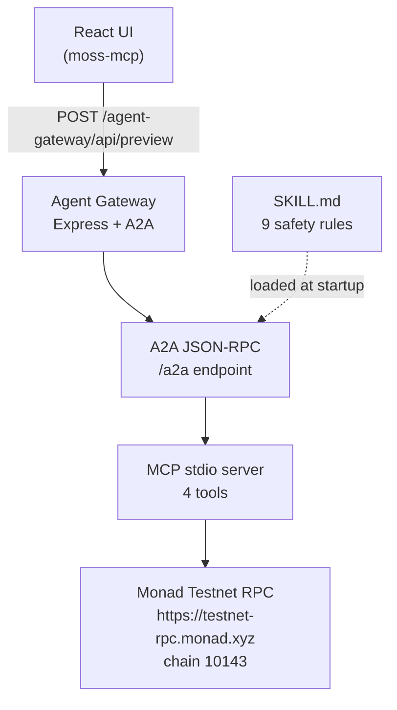

# Moss MCP Transaction Preview [](https://doi.org/10.5281/zenodo.21539761)

**Understand an unsigned MON transfer on Monad Testnet before it reaches your wallet.**

[](https://www.typescriptlang.org/)
[](https://react.dev/)
[](https://monad.xyz/)
[](https://a2a.dev/)
[](https://modelcontextprotocol.io/)
[](/)

🔗 **Live demo:** https://moss-mcp-transaction.replit.app/

---

## Problem and target user

Web3 newcomers often sign transactions without understanding what will happen. This project gives a developer, auditor, or curious user a way to inspect a native MON transfer — amount, gas, live balance, and nine safety rules — before any wallet interaction. It is not an auto-trading agent and does not sign or broadcast.

---

## Two modes

| Mode | Data source | Use case |
|------|------------|---------|
| **Mock Simulation** | Local mock engine, no network | Learn transaction structure, explore ERC-20 Transfer / Approve / Swap lifecycles, see Rejected / Reverted / System Error scenarios |
| **Live Monad Testnet Preview** | Live Monad Testnet RPC + A2A + MCP | Validate a real unsigned MON transfer against on-chain state before signing |

Switch between modes using the tab bar at the top of the app.

---

## One core user action

Enter a **sender address**, **recipient address**, and **amount in MON** (decimal string). Click **Preview on Monad Testnet**. Receive a structured artifact showing whether the transfer is `READY_FOR_WALLET_REVIEW` or `BLOCKED`, backed by live Monad Testnet RPC data.

---

## Architecture



---

## Truth table

| Scenario | Chain ID check | Balance sufficient | Valid addresses | Decision |
|----------|---------------|-------------------|-----------------|----------|
| Clean transfer, sufficient balance | ✓ 10143 | ✓ | ✓ | `READY_FOR_WALLET_REVIEW` |
| Wrong chain (RPC returns ≠ 10143) | ✗ | any | any | `BLOCKED` |
| Insufficient balance (amount + gas > balance) | ✓ | ✗ | ✓ | `BLOCKED` |
| Invalid sender address | ✓ | any | ✗ sender | `BLOCKED` |
| Invalid recipient address | ✓ | any | ✗ recipient | `BLOCKED` |
| Zero address as recipient | ✓ | any | ✗ (zero) | `BLOCKED` |
| Non-positive amount ("0") | ✓ | any | ✓ | `BLOCKED` |
| RPC timeout | timeout | — | ✓ | `BLOCKED` |
| Mismatched unsignedTx fields | ✓ | ✓ | ✓ | `BLOCKED` |
| Mainnet chain ID (1) via wrong RPC | ✗ 1≠10143 | — | ✓ | `BLOCKED` |

---

## 60-second demo

1. Open https://moss-mcp-transaction.replit.app/
2. Paste a Monad Testnet sender address (any valid `0x…` address with a testnet balance).
3. Paste a recipient address.
4. Enter an amount, e.g. `0.1`.
5. Click **Preview on Monad Testnet**.
6. Observe: live block number, chain ID (10143 verified), balance, gas estimate, nine safety rules, and decision.

---

## Evidence endpoints

| Endpoint | Method | Description |
|----------|--------|-------------|
| `/agent-gateway/healthz` | GET | Health check |
| `/agent-gateway/.well-known/agent-card.json` | GET | A2A Agent Card (cross-origin) |
| `/agent-gateway/api/preview` | POST | Run a transfer preview |
| `/agent-gateway/api/network` | GET | Live chain ID + latest block |
| `/agent-gateway/api/skill` | GET | Loaded skill metadata |

---

## Key concepts

### A2A — Agent-to-Agent Protocol

A2A is an open protocol (by Google) that defines how AI agents communicate. This app's Agent Gateway publishes an Agent Card at `/agent-gateway/.well-known/agent-card.json` advertising its `preview_monad_testnet_transfer` skill. The React UI calls the gateway's REST endpoint (`/agent-gateway/api/preview`); the gateway then uses the A2A SDK internally to process the task and returns a structured artifact. Any external agent (or Agent Stack deployment) can discover and call this gateway using the same standard.

Reference: <https://a2a.dev/>

### MCP — Model Context Protocol

MCP (by Anthropic) defines how agents call external tools. The gateway spawns a custom MCP server as a subprocess (stdio transport) and calls four tools in order: `preview_discover` → `preview_load` → `preview_action` → `preview_simulate`. Each tool is narrowly scoped: discover lists available actions, load returns the action schema, action builds the unsigned transaction, simulate fetches live chain data. MCP keeps the blockchain interface cleanly separated from agent logic.

Reference: <https://modelcontextprotocol.io/>

### Agent Skills

An Agent Skill is a version-controlled markdown file (`SKILL.md`) that defines what an agent knows and what rules it must enforce. This app's skill (`skills/monad-safe-transfer-preview/SKILL.md`) encodes nine rules: RECORD_INTENT, TESTNET_ONLY, DECIMAL_STRINGS, NO_PRIVATE_KEYS, NO_SIGNING, NO_BROADCAST, SIMULATION_REQUIRED, STOP_ON_WARNING, PRESENT_BEFORE_SIGNING. The file is SHA-256 hashed at startup; its hash is embedded in every preview artifact so reviewers can verify exactly which rule set was applied.

Reference: [`skills/monad-safe-transfer-preview/SKILL.md`](skills/monad-safe-transfer-preview/SKILL.md)

### Agent Stack

Agent Stack (by BeeAI) is a framework and CLI for discovering, running, and orchestrating A2A-compatible agents. Because this app publishes a valid Agent Card, any Agent Stack deployment can register it: `agentstack add https://moss-mcp-transaction.replit.app/agent-gateway`. The "unmanaged agent" pattern means the app runs on Replit's infrastructure and Agent Stack simply calls it externally — no Agent Stack runtime is embedded in the app itself.

Reference: <https://agentstack.beeai.dev/>

### Moss × Monad

Moss is a DeFi safety layer built on Monad. Its official MCP server targets Monad mainnet (chain ID 143) and exposes the same discover → load → action → simulate pattern this app implements. This app adapts Moss's safety model for Monad Testnet (chain ID 10143) using a custom MCP adapter — the Agent Skill's nine rules are directly inspired by Moss's risk-label and unsigned-tx-only design. Official Moss execution is not used; this project is a Testnet adapter that demonstrates the same design principles.

Reference: <https://docs.moss.ag>

---

## Technology layer

| Layer | Technology | Purpose |
|-------|-----------|---------|
| **Monad Testnet** | Chain ID 10143, `https://testnet-rpc.monad.xyz` | Live RPC for balance, gas, block data |
| **Agent Skill** | `skills/monad-safe-transfer-preview/SKILL.md` | 9 safety rules, SHA-256 verified |
| **A2A** | `@a2a-js/sdk` v1.0.1 | Structured task/artifact protocol |
| **MCP** | `@modelcontextprotocol/sdk` 1.30.0, stdio | 4 tools: discover, load, action, simulate |
| **Agent Stack** | Express + `PreviewAgentExecutor` | Orchestration and rate limiting |
| **Moss reference** | `https://docs.moss.ag` | Safety model inspiration (Moss is mainnet-only; this project adapts the model for Monad Testnet) |

---

## Safety boundary

- No private keys, no signing, no broadcasting.
- The unsigned transaction object is returned for display only.
- RPC preflight is not a guarantee of future execution success.
- The tool is for educational and development use only.
- All nine safety rules are enforced server-side and logged in the artifact.

---

## Local setup

**Requirements:** Node.js 22+, pnpm 9+

```bash
git clone https://github.com/your-org/moss-mcp-transaction-preview
cd moss-mcp-transaction-preview
pnpm install

# Start all services
pnpm --filter @workspace/agent-gateway run dev   # Agent Gateway (A2A + MCP + RPC)
pnpm --filter @workspace/moss-mcp run dev        # React UI
```

The React UI is served at `http://localhost:<PORT>` (PORT set by your environment).
The agent-gateway is at `http://localhost:3100` by default.

---

## Environment variables

| Variable | Default | Description |
|----------|---------|-------------|
| `PORT` | `3100` (gateway), assigned by Replit for UI | Service port |
| `BASE_PATH` | `/` | Vite base path for the React app |
| `MONAD_TESTNET_RPC_URL` | `https://testnet-rpc.monad.xyz` | Monad Testnet RPC endpoint |
| `PUBLIC_BASE_URL` | auto-detected | Override for Agent Card public URL |
| `NODE_ENV` | `production` | Controls log format and error detail |

**Never commit private keys, seed phrases, or funded wallet credentials.**

---

## Test commands

```bash
# Build the agent-gateway (required for integration tests)
pnpm --filter @workspace/agent-gateway run build

# Run all tests (unit + integration, no live network)
pnpm test

# Run the live Monad Testnet smoke test (requires network)
pnpm test:live

# TypeScript type checking across the workspace
pnpm typecheck

# Build all artifacts
pnpm build
```

---

## User feedback and scope reduction

After early user testing, the scope was reduced to one gold path: native MON transfers on Monad Testnet. ERC-20 transfers, approvals, and swap previews were removed from the UI and backend. The mock-first simulation engine was replaced with live A2A + MCP + RPC calls.

Key feedback:
- "I don't understand what 'scenario' means — just show me what happens for my address."
- "The eight-stage lifecycle is confusing. I just want to know if it's safe."
- "Why are there two languages on the same page?"

These drove the current single-language, single-action design.

---

## Known limitations

- Monad Testnet RPC can be slow or intermittently unavailable (10s timeout applies).
- Balance check is a snapshot; the network may change between preflight and actual signing.
- The unsigned transaction uses a placeholder gas estimate; actual gas may differ.
- No persistent storage of preview results (in-memory only, lost on restart).
- Agent Stack registration is not externally verified (see `evidence/agentstack-verification.md`).

---

## Future roadmap

- [ ] MetaMask deep-link: send the pre-built unsigned tx to MetaMask for review and signing
- [ ] ERC-20 transfer preview (non-native tokens on Monad Testnet)
- [ ] Balance warning when simulated amount approaches actual balance
- [ ] Permalink sharing of simulation results
- [ ] Mobile-optimized companion view
- [ ] PDF export of simulation report
- [ ] External Agent Stack registration and verification

---

## References

- [Moss documentation](https://docs.moss.ag) — safety model inspiration
- [Monad Testnet](https://monad.xyz/) — L1 blockchain this preview targets
- [A2A Protocol](https://a2a.dev/) — agent-to-agent structured task protocol
- [Model Context Protocol](https://modelcontextprotocol.io/) — MCP tool interface
- [Viem](https://viem.sh/) — TypeScript Ethereum library used for RPC calls

---

## License and disclaimer

MIT License.

**Educational preview only. No financial advice. No signing or broadcast. RPC preflight is not a future-execution guarantee. Use test addresses only.**
