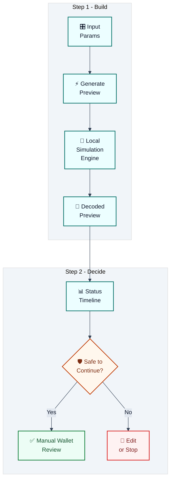
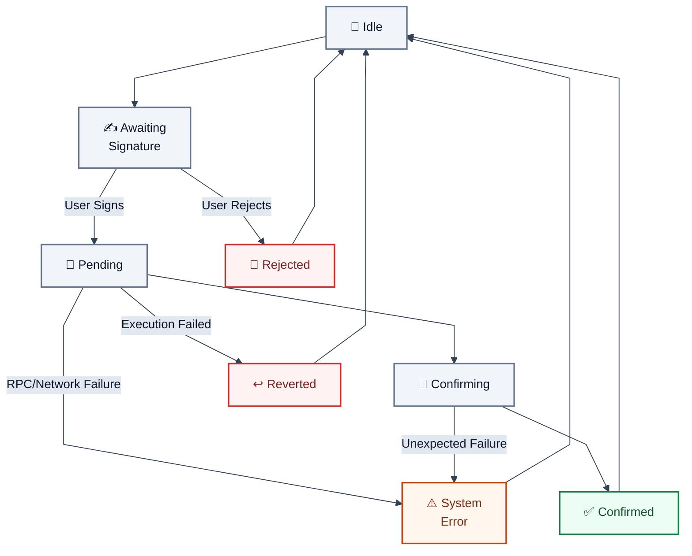
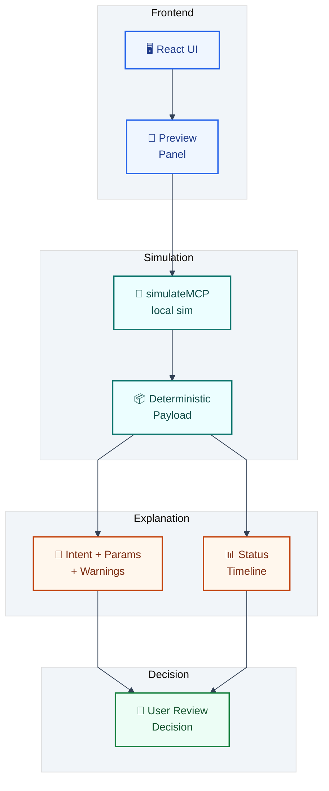
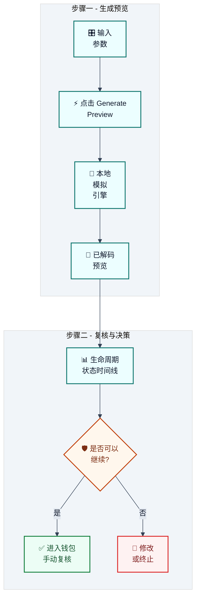
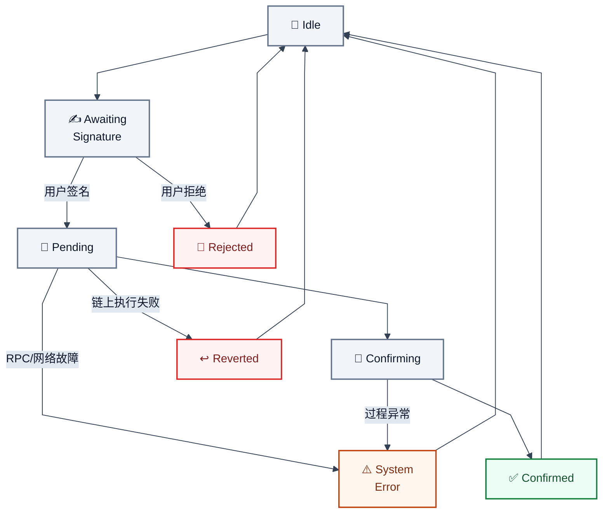
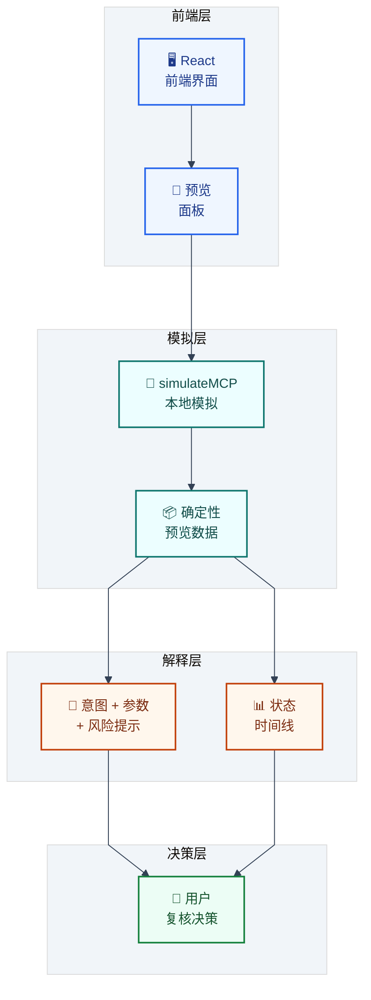

# Moss MCP Transaction Preview

<p align="center">
  <strong>🌿 Safer Web3 Preview Experience · 更安全的 Web3 预览体验</strong>
</p>

<p align="center">
  <a href="#english-version"><strong>English</strong></a> ·
  <a href="#中文版本"><strong>中文</strong></a>
</p>

<p align="center">
  
  
  
  
  
  
</p>

<p align="center">
  
  
  
  
  
</p>

<p align="center">
  <strong>🎬 Visual Storyboard · 三段式演示导览</strong>
</p>

<table>
  <thead>
    <tr>
      <th>🧭 Overview · 全局预览</th>
      <th>✅ Success Path · 成功路径</th>
      <th>🛑 Rejected Path · 拒签路径</th>
    </tr>
  </thead>
  <tbody>
    <tr>
      <td>
        <br/>
        <strong>EN:</strong> End-to-end flow from parameter input to result timeline.<br/>
        <strong>中文：</strong>从参数配置到结果时间线的完整流程。
      </td>
      <td>
        <br/>
        <strong>EN:</strong> Shows confirmed outcome, green status progression, and final review confidence.<br/>
        <strong>中文：</strong>展示确认成功、绿色状态流转与最终复核信心。
      </td>
      <td>
        <br/>
        <strong>EN:</strong> Shows user rejection boundary, no broadcast, and safe stop behavior.<br/>
        <strong>中文：</strong>展示用户拒签边界、不会广播、并安全终止流程。
      </td>
    </tr>
  </tbody>
</table>

<p align="center">
  <strong>🧩 Preview First · Explain Risks · Keep Users In Control</strong><br/>
  <strong>先预览，再解释风险，始终由用户掌控</strong>
</p>

---

## English Version

### ✨ Quick Navigation

- [🚀 Live Demo](#live-demo)
- [🎯 Demo Goal](#demo-goal)
- [🧭 User Experience Walkthrough](#user-experience-walkthrough)
- [🗺️ Visual Flow Diagram](#visual-flow-diagram)
- [🎬 Demo GIF Generation Pipeline](#demo-gif-generation-pipeline)
- [🤖 GitHub Actions GIF Auto-Update](#github-actions-gif-auto-update)
- [🎨 Diagram Color Design System](#diagram-color-design-system)
- [⚙️ Core Features](#core-features)
- [📊 Status Lifecycle](#status-lifecycle)
- [🛣️ Roadmap](#roadmap)

### 🧠 What This Demo Is

Moss MCP Transaction Preview is a beginner-friendly Web3 demo that helps users understand a blockchain operation before signing. It uses a Moss MCP-style preview and simulation flow to explain operation intent, parameters, status, warnings, and safety boundaries. The demo is designed for learning and product testing. It is not an auto-trading agent and does not sign or broadcast transactions.

### 🚀 Live Demo

🔗 **Live Demo:** https://moss-mcp-transaction.replit.app/

### 🌟 Snapshot

| Focus | What You Get |
|------|---------------|
| 🛡️ Safety | Clear warning language before any signing step |
| 🧠 Clarity | Human-readable intent + parameter breakdown |
| 🧪 Learning | Mock-first flow for safe experimentation |
| 🔄 State Tracking | Full lifecycle from Idle to Confirmed/Reverted |

### 🎯 Demo Goal

- Help beginners understand a blockchain operation before signing.
- Show the full transaction lifecycle and its possible states.
- Explain the difference between Rejected, Reverted, and System Error.
- Make Moss MCP easier to understand for newcomers and developers.

### 🧭 User Experience Walkthrough

1. Read the top introduction to understand what the app does.
2. Learn what Moss MCP means in this demo context.
3. Choose a mock operation type (Transfer, Approve, or Swap).
4. Enter test-only parameters — no real addresses or funds required.
5. Click **Generate Preview**.
6. Read the preview card: protocol, method, intent, and parameters.
7. Check the status badge and follow the status timeline.
8. Review any warnings and the safety checklist before proceeding.

### 🧾 Input Guide (Detailed)

Use this section as a quick reference before clicking **Generate Preview**.

| Field | What It Means | Practical Tip |
|------|----------------|---------------|
| `Operation Type` | Chooses which contract behavior to simulate. | Start with `ERC20 Transfer` for the clearest baseline. |
| `Account Address` | The wallet context for the simulation. | Use a test/mock address only. |
| `Token Address` | Token contract used by the operation. | Keep it consistent across scenarios for easier comparison. |
| `Recipient / Spender Address` | Target receiver (Transfer/Swap) or approved spender (Approve). | Double-check role meaning before reading the intent text. |
| `Amount` | Token amount used in simulation. | Try both small and large values to trigger different warnings. |
| `Mock Scenario` | Forces terminal outcome states for learning and demo. | Use this to rehearse success/failure communication. |

#### ⚙️ Operation Type Explained

| Operation Type | Simulated Method | Primary Intent | Typical Risk Signal |
|---------------|------------------|----------------|---------------------|
| `ERC20 Transfer` | `transfer(address,uint256)` | Send tokens to recipient. | `LARGE_AMOUNT` warning when amount is high. |
| `ERC20 Approve` | `approve(address,uint256)` | Allow spender to use tokens. | `APPROVE_UNLIMITED` for very large approvals. |
| `Mock Swap Preview` | `exactInputSingle(params)` | Swap input token for estimated output. | `SLIPPAGE_RISK` due to execution uncertainty. |

#### 🎭 Mock Scenario Explained

| Scenario | Final Status | What It Simulates | How to Read It |
|----------|--------------|-------------------|----------------|
| `Success` | `CONFIRMED` | Simulated happy path confirmation. | Treat as best-case preview, not guarantee. |
| `User Rejected` | `REJECTED` | User declines signing in wallet. | No on-chain submission happened. |
| `On-chain Reverted` | `REVERTED` | Tx would fail during chain execution. | Watch revert warnings and cause hints. |
| `System Error` | `SYSTEM_ERROR` | RPC/MCP pipeline failure. | Infrastructure issue, not user action. |

> Safety reminder: all values are mock/demo inputs. The app does not sign or broadcast transactions.

### 🗺️ Visual Flow Diagram



### 🎬 Demo GIF Generation Pipeline

This repository includes a reproducible script pipeline to generate dual comparison GIFs from real UI interaction:

- `assets/moss-mcp-transaction-preview-success.gif`
- `assets/moss-mcp-transaction-preview-rejected.gif`
- `assets/moss-mcp-transaction-preview-demo.gif` (compatibility copy of success)

```mermaid
%%{init: {'theme':'base','flowchart': {'htmlLabels': true, 'nodeSpacing': 56, 'rankSpacing': 70, 'curve': 'linear'},'themeVariables': {'fontFamily':'Trebuchet MS, Segoe UI, sans-serif','fontSize':'15px','primaryColor':'#eef6ff','primaryBorderColor':'#3b82f6','primaryTextColor':'#0f172a','lineColor':'#334155','secondaryColor':'#f8fafc','tertiaryColor':'#f1f5f9','edgeLabelBackground':'#e2e8f0'}}}%%
flowchart LR
  subgraph P1[Prepare]
    A["📦 pnpm install"] --> B["🎬 pnpm run<br/>demo:gif"]
  end

  subgraph P2[Capture]
    C["🚀 Start local<br/>app"] --> D["🤖 Auto<br/>interaction"]
    D --> E["🖼 Capture<br/>PNG frames"]
  end

  subgraph P3[Encode]
    F["🎨 Palette +<br/>GIF encode"]
    G["✅ success +<br/>🛑 rejected"]
    H["📎 demo<br/>compatibility copy"]
  end

  B --> C
  E --> F --> G --> H

  classDef prep fill:#eff6ff,stroke:#2563eb,stroke-width:1.8px,color:#1e3a8a;
  classDef capture fill:#ecfeff,stroke:#0f766e,stroke-width:1.8px,color:#134e4a;
  classDef encode fill:#fff7ed,stroke:#c2410c,stroke-width:1.8px,color:#7c2d12;

  class A,B prep;
  class C,D,E capture;
  class F,G,H encode;
```



**Commands**

```bash
pnpm install
pnpm run demo:gif
```

**What the capture includes (post-click coverage):**

- Expand "What is Moss MCP?"
- Configure operation/scenario/amount
- Click **Generate Preview**
- Wait for preview result card to appear
- Scroll and capture risk/warnings/status lifecycle sections

### 🤖 GitHub Actions GIF Auto-Update

This repository includes an automation workflow at `.github/workflows/update-demo-gifs.yml`.

- Trigger conditions:
  - Push to `main` with changes in frontend demo files, capture scripts, or lock/package files.
  - Manual run through `workflow_dispatch`.
- What the workflow does:
  - Installs dependencies and Playwright Chromium.
  - Runs `pnpm run demo:gif` to regenerate GIFs.
  - Auto-commits only the three generated assets back to `main`.
- Safety guards:
  - Skips runs when actor is `github-actions[bot]` to avoid recursion.
  - Uses workflow concurrency to cancel stale in-progress runs.

### 🎨 Diagram Color Design System

All Mermaid diagrams use a consistent visual token strategy to balance readability and style.

- Glass-like translucency:
  - Nodes use alpha hex fills (for example `#0f766e29`) to keep a soft premium layered look.
- Dark/light harmony:
  - Text and border contrast is tuned to remain legible on both themes.
  - Edge labels use a dedicated dark translucent background and light text for stable readability.
- Semantic colors:
  - Teal = simulation/primary flow, blue = system/process, green = success, red = stop/error, amber = warning/decision.
- Compatibility note:
  - Mermaid config intentionally uses conservative syntax supported by GitHub's renderer.
  - Solid hex colors are used for maximum cross-environment rendering reliability.

### 🎞️ Scenario Comparison

<table>
  <thead>
    <tr>
      <th>✅ Success Path</th>
      <th>🛑 Rejected Path</th>
    </tr>
  </thead>
  <tbody>
    <tr>
      <td>
        <br/>
        <strong>🧾 Outcome:</strong> Confirmed and completed<br/>
        <strong>🎯 Status cues:</strong> Positive/green confirmation states<br/>
        <strong>👀 Focus:</strong> Preview details, risk labels, lifecycle completion
      </td>
      <td>
        <br/>
        <strong>🧾 Outcome:</strong> User rejected, no on-chain submission<br/>
        <strong>🎯 Status cues:</strong> Rejected terminal state and warning context<br/>
        <strong>👀 Focus:</strong> Manual review boundary and safe stop flow
      </td>
    </tr>
  </tbody>
</table>

### 🔍 What Is Moss MCP?

- **MCP** stands for Model Context Protocol.
- **Moss MCP** is a structured interface between AI agents and Moss/Web3 operations.
- In this demo, it is used conceptually for the `discover → load → action → simulate` lifecycle.
- It is used for preview and simulation **before** signing — not for automatic execution.

### ⚙️ Core Features

- Beginner-friendly transaction preview
- Mock operation scenarios (Transfer, Approve, Swap)
- Status badge timeline with 8 lifecycle states
- Preview result explanation ("How to read this preview" guide)
- Safety checklist before proceeding to wallet
- Clear distinction between Rejected / Reverted / System Error
- Mock-first design — safe to test with no real funds
- Future Moss RPC / Monad test chain integration plan

### 📊 Status Lifecycle

| Status | Meaning |
|--------|---------|
| **Idle** | No simulation has been run yet. |
| **Awaiting Signature** | The transaction is built and waiting for the user to sign. |
| **Pending** | The signed transaction has been submitted and is waiting to be picked up by the network. |
| **Confirming** | The transaction has been included in a block and is accumulating confirmations. |
| **Confirmed** | The transaction is finalized — the on-chain state has changed. |
| **Rejected** | The user declined to sign. Nothing was broadcast; the chain is unchanged. |
| **Reverted** | The transaction was broadcast and mined, but the EVM rolled back its state changes. Gas was still consumed. |
| **System Error** | An unexpected error occurred before or during submission (network failure, RPC timeout, etc.). |

### 🔄 Status Transition Diagram



### 🏗️ Architecture at a Glance



### 🛠️ Developer Notes

- The current app is **mock-first** — `src/lib/mockMcp.ts` returns deterministic simulated data with no network calls.
- It is **not connected to a live Moss MCP server yet**.
- Future integration: replace the body of `simulateMCP()` with live Moss MCP `discover / load / action / simulate` SDK calls.
- Environment variables use placeholders only:
  ```
  VITE_MOSS_RPC_URL=    # Planned Moss MCP server endpoint (not active in mock mode)
  VITE_MONAD_RPC_URL=   # Monad testnet/mainnet RPC
  ```
- **Never commit private keys, seed phrases, or funded wallet credentials.**

### 💻 Run Locally

**Requirements:** Node.js 20+, pnpm 9+

```bash
git clone https://github.com/your-org/moss-mcp-transaction-preview.git
cd moss-mcp-transaction-preview
pnpm install
pnpm --filter @workspace/moss-mcp run dev
```

No wallet, no funds, and no API key are needed for mock mode.

### 🧷 Safety Boundaries

> This demo is for transaction preview and learning only. It does not sign transactions, broadcast transactions, store private keys, or provide financial advice.

### 🧪 Known Issues

- Uses mock data first — all results are simulated, not real.
- Real Moss MCP / Moss RPC integration is planned but not yet implemented.
- Simulation is not a guarantee of on-chain safety.
- UI copy still needs broader user testing.

### 🛣️ Roadmap

- [ ] Add real Moss MCP integration (`discover / load / action / simulate`)
- [ ] Add Monad test chain RPC configuration
- [ ] Add better and more varied transaction examples
- [x] Add a 30-second GIF / video walkthrough
- [x] Collect feedback from at least 3 real users
- [ ] Improve onboarding copy based on user testing
- [ ] Add MetaMask transaction handoff — after the preview passes, let users send the pre-built transaction to MetaMask, while keeping manual user review and signature confirmation intact
- [ ] Connect to a live Moss MCP server so previews can show real protocol and on-chain data
- [ ] Warn users when the simulated amount exceeds their actual token balance or appears inconsistent with available account data

> These roadmap items are future-facing. The current demo remains preview/simulation-first and does not sign or broadcast transactions.

---

## 中文版本

### ✨ 快速导航

- [🚀 在线 Demo](#在线-demo)
- [🎯 Demo 目标](#demo-目标)
- [🧭 用户体验流程](#用户体验流程)
- [🗺️ 可视化流程图](#可视化流程图)
- [🎬 Demo GIF 生成流程](#demo-gif-生成流程)
- [🤖 GitHub Actions 自动更新 GIF](#github-actions-自动更新-gif)
- [🎨 流程图配色设计体系](#流程图配色设计体系)
- [⚙️ 核心功能](#核心功能)
- [📊 状态生命周期](#状态生命周期)
- [🛣️ 路线图](#路线图)

### 🧠 这个 Demo 是什么

Moss MCP Transaction Preview 是一个面向 Web3 新人的交易预览 Demo，帮助用户在签名前理解一次链上操作可能会做什么。它使用 Moss MCP 风格的 preview / simulation 流程，解释操作意图、参数、状态、风险提示和安全边界。本 Demo 仅用于学习和产品测试，不是自动交易机器人，不会签名、广播交易，也不会保存私钥或助记词。

### 🚀 在线 Demo

🔗 **在线 Demo：** https://moss-mcp-transaction.replit.app/

### 🌟 一眼看懂

| 关注点 | 你能得到什么 |
|------|---------------|
| 🛡️ 安全性 | 在签名前看到清晰的风险提示 |
| 🧠 可理解性 | 用自然语言解释意图和参数 |
| 🧪 学习友好 | Mock-first 流程，安全试验无负担 |
| 🔄 状态追踪 | 从 Idle 到 Confirmed/Reverted 的完整生命周期 |

### 🎯 Demo 目标

- 帮助新手在签名前理解链上操作。
- 展示完整的交易生命周期状态。
- 解释 Rejected、Reverted 和 System Error 的区别。
- 让 Moss MCP 更容易被新用户和开发者理解。

### 🧭 用户体验流程

1. 阅读页面顶部介绍，了解 App 的作用。
2. 理解本 Demo 中 Moss MCP 的角色和定位。
3. 选择一个模拟链上操作类型（转账 / 授权 / 兑换）。
4. 输入仅用于测试的参数，无需真实地址或资金。
5. 点击 **Generate Preview**。
6. 阅读交易预览卡片：协议、方法、意图、参数。
7. 查看状态徽章和状态时间线。
8. 检查风险提示和安全检查清单，再决定是否继续。

### 🧾 输入参数详解

点击 **Generate Preview** 前，可先对照以下说明快速检查输入。

| 字段 | 含义 | 实用建议 |
|------|------|----------|
| `Operation Type` | 选择要模拟的合约行为类型。 | 建议先用 `ERC20 Transfer` 建立基准认知。 |
| `Account Address` | 作为模拟上下文的钱包地址。 | 仅使用测试/模拟地址。 |
| `Token Address` | 本次操作关联的代币合约地址。 | 对比不同场景时尽量保持一致。 |
| `Recipient / Spender Address` | 转账/兑换目标接收方，或授权中的 spender。 | 先确认角色再阅读 intent 文本。 |
| `Amount` | 用于模拟的代币数量。 | 尝试小额和大额，观察 warning 变化。 |
| `Mock Scenario` | 强制指定终态，用于学习和演示。 | 用来演练成功/失败路径说明。 |

#### ⚙️ Operation Type 说明

| Operation Type | 模拟方法 | 主要意图 | 常见风险信号 |
|---------------|----------|----------|--------------|
| `ERC20 Transfer` | `transfer(address,uint256)` | 向接收方发送代币。 | 数额过大时触发 `LARGE_AMOUNT`。 |
| `ERC20 Approve` | `approve(address,uint256)` | 授权 spender 使用代币。 | 超大授权触发 `APPROVE_UNLIMITED`。 |
| `Mock Swap Preview` | `exactInputSingle(params)` | 用输入代币兑换预估输出。 | 因执行不确定性触发 `SLIPPAGE_RISK`。 |

#### 🎭 Mock Scenario 说明

| 场景 | 最终状态 | 模拟含义 | 解读方式 |
|------|----------|----------|----------|
| `Success` | `CONFIRMED` | 模拟顺利完成的最佳路径。 | 这是理想预览，不是链上保证。 |
| `User Rejected` | `REJECTED` | 用户在钱包侧拒绝签名。 | 不会产生上链提交。 |
| `On-chain Reverted` | `REVERTED` | 交易在链上执行阶段失败。 | 重点查看回滚 warning 与原因提示。 |
| `System Error` | `SYSTEM_ERROR` | RPC/MCP 链路异常。 | 属于基础设施问题，不是用户操作问题。 |

> 安全提示：以上均为 mock/demo 输入，本应用不会签名或广播交易。

### 🗺️ 可视化流程图



### 🎬 Demo GIF 生成流程

仓库中已经内置了可复现脚本流程，可通过真实页面交互自动生成双场景对比 GIF：

- `assets/moss-mcp-transaction-preview-success.gif`
- `assets/moss-mcp-transaction-preview-rejected.gif`
- `assets/moss-mcp-transaction-preview-demo.gif`（兼容副本，等同 success）

```mermaid
%%{init: {'theme':'base','flowchart': {'htmlLabels': true, 'nodeSpacing': 56, 'rankSpacing': 70, 'curve': 'linear'},'themeVariables': {'fontFamily':'Trebuchet MS, Segoe UI, sans-serif','fontSize':'15px','primaryColor':'#eef6ff','primaryBorderColor':'#3b82f6','primaryTextColor':'#0f172a','lineColor':'#334155','secondaryColor':'#f8fafc','tertiaryColor':'#f1f5f9','edgeLabelBackground':'#e2e8f0'}}}%%
flowchart LR
  subgraph P1[准备]
    A["📦 pnpm install"] --> B["🎬 pnpm run<br/>demo:gif"]
  end

  subgraph P2[录制]
    C["🚀 启动<br/>本地应用"] --> D["🤖 自动<br/>交互录制"]
    D --> E["🖼 输出<br/>PNG 帧"]
  end

  subgraph P3[编码]
    F["🎨 调色板 +<br/>GIF 编码"]
    G["✅ success +<br/>🛑 rejected"]
    H["📎 demo<br/>兼容副本"]
  end

  B --> C
  E --> F --> G --> H

  classDef prep fill:#eff6ff,stroke:#2563eb,stroke-width:1.8px,color:#1e3a8a;
  classDef capture fill:#ecfeff,stroke:#0f766e,stroke-width:1.8px,color:#134e4a;
  classDef encode fill:#fff7ed,stroke:#c2410c,stroke-width:1.8px,color:#7c2d12;

  class A,B prep;
  class C,D,E capture;
  class F,G,H encode;
```



**执行命令**

```bash
pnpm install
pnpm run demo:gif
```

**录制覆盖内容（包含点击后场景）：**

- 展开 "What is Moss MCP?"
- 配置 operation / scenario / amount
- 点击 **Generate Preview**
- 等待预览结果卡片出现
- 滚动并录制 risk / warnings / status lifecycle 区域

### 🤖 GitHub Actions 自动更新 GIF

仓库内置了自动化工作流：`.github/workflows/update-demo-gifs.yml`。

- 触发条件：
  - 推送到 `main`，且改动命中前端 demo 文件、录制脚本、或依赖锁文件。
  - 手动触发 `workflow_dispatch`。
- 工作流执行内容：
  - 安装依赖与 Playwright Chromium。
  - 运行 `pnpm run demo:gif` 重新生成 GIF。
  - 仅将三张生成产物自动提交回 `main`。
- 防护策略：
  - 当触发者为 `github-actions[bot]` 时跳过，避免递归触发。
  - 启用并发控制，自动取消过期的进行中任务。

### 🎨 流程图配色设计体系

所有 Mermaid 流程图采用统一视觉 token 策略，在可读性和质感之间保持平衡。

- 半透明玻璃质感：
  - 节点填充使用带透明度的 8 位十六进制颜色（如 `#0f766e29`），保留分层高级感。
- 深浅色模式和谐：
  - 文本与边框对比度经过统一调优，兼顾 dark / light mode。
  - 箭头标签采用独立的深色半透明底和浅色文字，确保始终可读。
- 语义配色：
  - 青色 = 模拟/主流程，蓝色 = 系统/过程，绿色 = 成功，红色 = 停止/错误，琥珀色 = 警告/决策。
- 兼容性说明：
  - Mermaid 配置采用 GitHub 渲染器更稳妥的保守语法。
  - 统一使用纯十六进制颜色，优先保证跨环境渲染稳定性。

### 🎞️ 场景对比

<table>
  <thead>
    <tr>
      <th>✅ 成功路径</th>
      <th>🛑 拒签路径</th>
    </tr>
  </thead>
  <tbody>
    <tr>
      <td>
        <br/>
        <strong>🧾 结果：</strong>交易确认并完成<br/>
        <strong>🎯 状态特征：</strong>以绿色/正向确认状态收敛<br/>
        <strong>👀 观察重点：</strong>预览细节、风险标签、完整生命周期
      </td>
      <td>
        <br/>
        <strong>🧾 结果：</strong>用户拒签，不会上链提交<br/>
        <strong>🎯 状态特征：</strong>出现 Rejected 终态与风险上下文<br/>
        <strong>👀 观察重点：</strong>人工复核边界与安全终止流程
      </td>
    </tr>
  </tbody>
</table>

### 🔍 什么是 Moss MCP？

- **MCP** 是 Model Context Protocol（模型上下文协议）。
- **Moss MCP** 是 AI Agent 与 Moss/Web3 操作之间的结构化接口。
- 在本 Demo 中，它用于理解 `discover → load → action → simulate` 的 preview / simulation 流程。
- 它用于签名前预览和模拟，**不是**自动执行交易。

### ⚙️ 核心功能

- 新手友好的交易预览
- 模拟操作场景（转账、授权、兑换）
- 包含 8 个生命周期状态的状态徽章时间线
- 预览结果解释（"如何阅读这份预览"指引）
- 进入钱包前的安全检查清单
- 明确区分 Rejected / Reverted / System Error
- Mock-first 安全测试设计，无需真实资金
- 未来接入 Moss RPC / Monad test chain 的计划

### 📊 状态生命周期

| 状态 | 含义 |
|------|------|
| **Idle** | 尚未运行任何模拟。 |
| **Awaiting Signature** | 交易已构建完成，等待用户签名。 |
| **Pending** | 已签名的交易已提交，等待网络处理。 |
| **Confirming** | 交易已被打包进区块，正在积累确认数。 |
| **Confirmed** | 交易已最终确认，链上状态已变更。 |
| **Rejected** | 用户拒绝签名，交易未广播，链上状态未变化。 |
| **Reverted** | 交易已广播并被打包，但 EVM 回滚了状态变更。Gas 仍被消耗。 |
| **System Error** | 提交前或提交过程中发生意外错误（网络故障、RPC 超时等）。 |

### 🔄 状态流转图



### 🏗️ 架构总览



### 🛠️ 开发者说明

- 当前版本采用 **mock-first**——`src/lib/mockMcp.ts` 返回确定性的模拟数据，无任何网络请求。
- 当前**尚未连接 live Moss MCP server**。
- 后续集成：将 `simulateMCP()` 的函数体替换为真实 Moss MCP 的 `discover / load / action / simulate` SDK 调用。
- 环境变量只使用占位符：
  ```
  VITE_MOSS_RPC_URL=    # 预留的 Moss MCP server 地址（mock 模式下不生效）
  VITE_MONAD_RPC_URL=   # Monad 测试网 / 主网 RPC
  ```
- **不要提交私钥、助记词或任何含资金的钱包凭据。**

### 💻 本地运行

**环境要求：** Node.js 20+，pnpm 9+

```bash
git clone https://github.com/your-org/moss-mcp-transaction-preview.git
cd moss-mcp-transaction-preview
pnpm install
pnpm --filter @workspace/moss-mcp run dev
```

Mock 模式下无需钱包、资金或 API Key。

### 🧷 安全边界

> 本 Demo 仅用于交易预览和学习，不签名、不广播交易、不保存私钥或助记词，也不构成金融建议。

### 🧪 已知问题

- 当前优先使用 mock 数据，所有结果均为模拟，非真实链上结果。
- 真实 Moss MCP / Moss RPC 接入仍在计划中，尚未实现。
- simulation 不等于安全保证。
- UI 文案仍需要更多用户测试。

### 🛣️ 路线图

- [ ] 接入真实 Moss MCP（`discover / load / action / simulate`）
- [ ] 添加 Monad test chain RPC 配置
- [ ] 增加更好、更多样的交易示例
- [x] 添加 30 秒 GIF / 视频演示
- [x] 收集至少 3 名真实用户的反馈
- [ ] 根据用户测试改进 onboarding 文案
- [ ] 添加 MetaMask 交易交接：在 preview 通过后，让用户可以把预构建交易发送到 MetaMask，但仍由用户手动检查和签名确认
- [ ] 连接 live Moss MCP server，让 preview 可以展示真实协议数据和链上上下文
- [ ] 添加余额感知 warning：当模拟金额超过用户实际 token balance，或与账户数据不一致时提醒用户

> 以上路线图属于未来计划。当前 Demo 仍然以 preview / simulation 为主，不签名，也不广播交易。

---

## License

MIT — see [LICENSE](./LICENSE).

---

## Disclaimer / 免责声明

This project is a learning and preview tool. It is not financial advice. It does not interact with real funds.

本项目仅为学习和预览工具，不构成金融建议，不操作真实资金。
